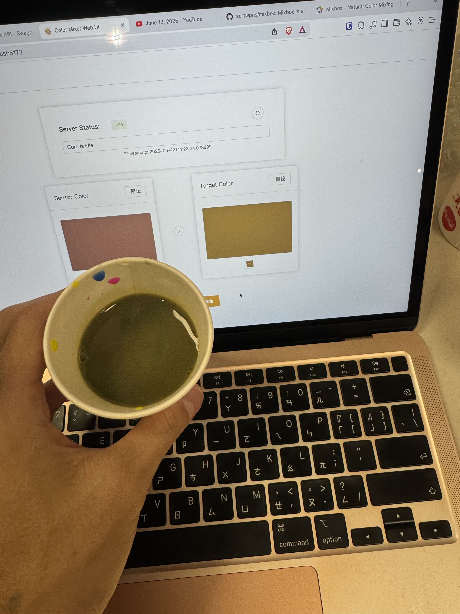
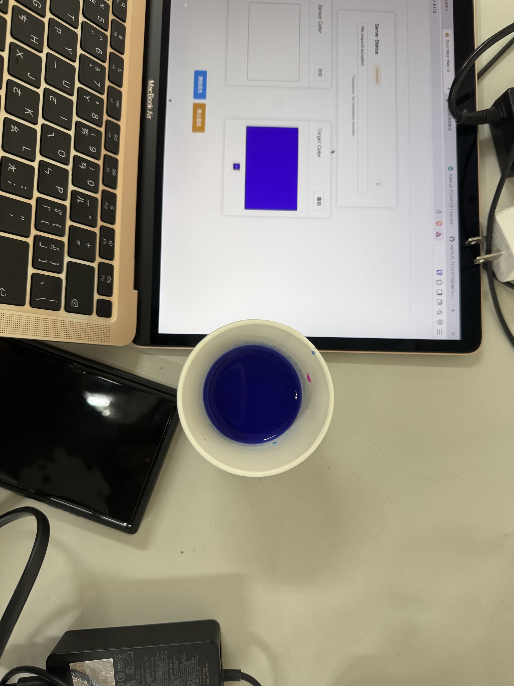
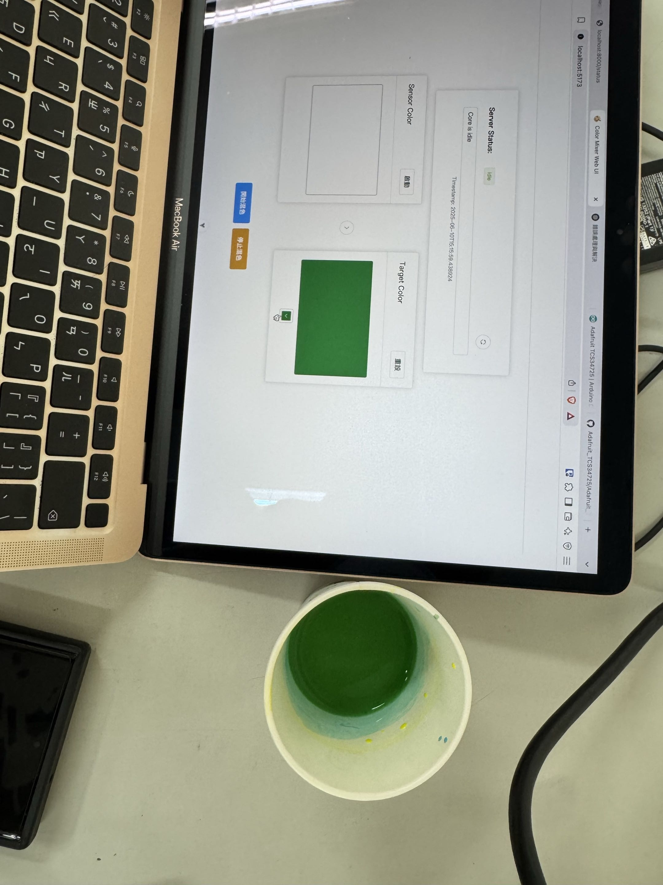
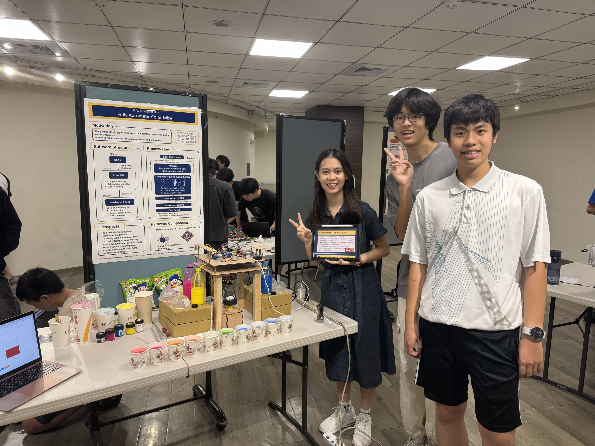

# 🎨 Color-Mixer

> Final Project for "Car Car Course" at NTUEE

A lightweight **color-mixing toolkit** that combines a web UI, a REST/WebSocket backend (FastAPI), raspberry PI, and a scriptable Mixbox-based algorithm.







---

## ✨ Features

- **Web UI (Vue.js)** – intuitive sliders + live color preview
- **FastAPI backend** – REST + WebSocket endpoints for automation or mobile apps
- **Mixbox algorithm** – perceptually linear mixing model out of the box
- **Sensor calibration helpers** – integrate TCS34725 sensor with Raspberry PI board.

---

## 📋 Prerequisites

| Tool                                           | Version | Purpose                          |
| ---------------------------------------------- | ------- | -------------------------------- |
| **Git**                                        | ≥ 2.30  | clone the repository             |
| **pyenv**                                      | ≥ 2.3   | manage local Python versions     |
| **Python**                                     | 3.12.x  | runtime (installed via pyenv)    |
| **Poetry**                                     | ≥ 2.1   | dependency & virtual-env manager |
| **Node + npm** <sub>(optional)</sub>           | –       | for `wscat` WebSocket testing    |
| **Raspberry PI 3b board with TCS34725 sensor** | -       | for hardware agent               |

---

## 🚀 Quick Start

### 1 Clone the repository

```bash
git clone https://github.com/AaronWu-train/color-mixer.git
cd color-mixer
```

### 2 Install pyenv

<details>
<summary><b>macOS (Homebrew)</b></summary>

```bash
brew update
brew install pyenv
echo 'eval "$(pyenv init -)"' >> ~/.zshrc
source ~/.zshrc
```

</details>

<details>
<summary><b>Ubuntu / Debian</b></summary>

```bash
curl https://pyenv.run | bash
echo 'export PATH="$HOME/.pyenv/bin:$PATH"' >> ~/.bashrc
echo 'eval "$(pyenv init -)"'     >> ~/.bashrc
source ~/.bashrc
```

</details>

### 3 Install & pin Python 3.12

```bash
pyenv install 3.12         # skip if already installed
pyenv local   3.12         # writes .python-version
python --version           # should print Python 3.12.x
```

### 4 Install Poetry

```bash
curl -sSL https://install.python-poetry.org | python3 -
echo 'export PATH="$HOME/.local/bin:$PATH"' >> ~/.bashrc # or ~/.zshrc
source ~/.bashrc
poetry --version
```

### 5 Install dependencies

```bash
poetry env use $(pyenv which python)   # tell Poetry to use 3.12
poetry install                         # creates .venv + installs packages
```

### 6. Set Up pre-commit git hook

```bash
pre-commit install
```

---

## 🛠 Common Commands

| Goal                  | Command                                                                    |
| --------------------- | -------------------------------------------------------------------------- |
| Drop into virtual-env | `eval "$(poetry env activate)"`                                            |
| Run core API server   | `poetry run uvicorn core.main:app --reload --port 8000`                    |
| Run hw_agent API      | `poetry run uvicorn hw_agent.main:app --reload --host 0.0.0.0 --port 9000` |
| Run Web UI            | `cd web` and follow instructions in `README.md` in the `web/` folder       |

### Other Commands

| Goal                      | Command                         |
| ------------------------- | ------------------------------- |
| Sync dependency           | `poetry install`                |
| Add a runtime dependency  | `poetry add mixbox`             |
| Add a dev-only dependency | `poetry add --group dev pytest` |

---

## 📜 License

Distributed under the **MIT License**. See [`LICENSE`](LICENSE) for details.
